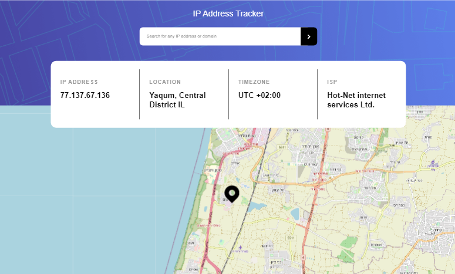
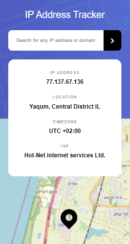

# Frontend Mentor - IP address tracker solution


This is a solution to the [IP address tracker challenge on Frontend Mentor](https://www.frontendmentor.io/challenges/ip-address-tracker-I8-0yYAH0).

## Table of contents

- [Overview](#overview)
  - [The challenge](#the-challenge)
  - [Screenshot](#screenshot)
  - [Links](#links)
- [My process](#my-process)
  - [Built with](#built-with)
  - [What I learned](#what-i-learned)
  - [Continued development](#continued-development)
  - [Useful resources](#useful-resources)
- [Author](#author)

## Overview

### The challenge

Users should be able to:

- View the optimal layout for each page depending on their device's screen size
- See hover states for all interactive elements on the page
- See their own IP address on the map on the initial page load
- Search for any IP addresses or domains and see the key information and location

### Screenshot




### Links

- Solution URL: [solution URL](https://github.com/zemira-k/ip-adress-tracker-master.git)
- Live Site URL: [live site URL](https://zemira-k.github.io/ip-adress-tracker-master/)

## My process

### Built with

- Semantic HTML5 markup
- CSS custom properties
- Flexbox
- Mobile-first workflow
- [React](https://reactjs.org/) - JS library

### What I learned

changing map view and map icon

```js
function ChangeView({ center, zoom }) {
    const map = useMap();
    map.setView(center, zoom);
    return null;
  }
```

### Useful resources

- [IP Geolocation API by IPify](https://geo.ipify.org/) - This helped me to get the IP Address locations.
- [LeafletJS](https://leafletjs.com/) - This helped me to generate the map. I have a lot more to learn about this.

## Author

- Website - (https://www.zemira-k.com)
- Frontend Mentor - (https://www.frontendmentor.io/profile/zemira-k)
